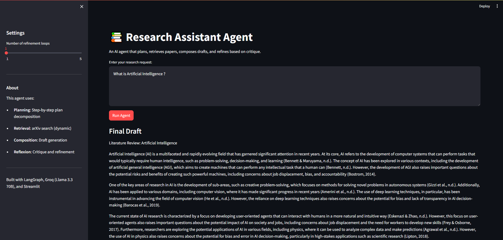
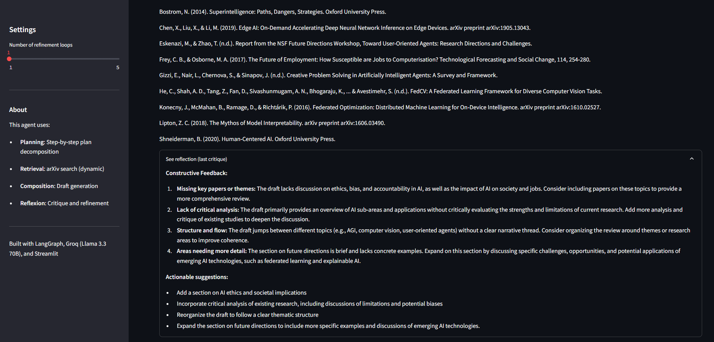
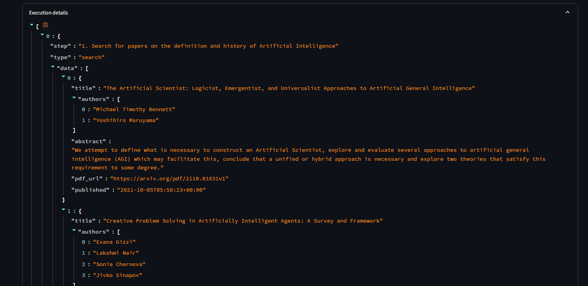

# Research Assistant Agent with Reflexion & Tool Use

An AI research assistant built with LangGraph that plans, retrieves academic papers from arXiv, composes literature review drafts, and iteratively refines them using a Reflexion loop (critique → revise → repeat).

## Architecture

The agent is built as a **directed state graph** using LangGraph. Each node is a pure function that reads from and writes to a shared `AgentState` dict — no node holds its own memory, and all coordination happens through that single state object passed along the graph.

```
planner → executor → composer → reflector → refiner ─┐
                                               ↑       │ (loop until max_refinements)
                                               └───────┘
                                                       └→ END
```

---

### Planner

#### What it does
Takes the raw user request and asks the LLM to break it into a concrete, numbered action plan (e.g. "1. Search for papers on X", "2. Summarize key findings").

#### Why it matters
Separating planning from execution prevents the agent from trying to do everything in one prompt. The plan also acts as a routing signal — the executor reads each step and decides which tool (if any) to call based on keywords like "search" or "fetch".

#### Temperature
`0.4` — slightly higher to encourage varied, creative decomposition.

---

### Executor

#### What it does
Iterates over each plan step and dispatches to the right tool by keyword matching on the step text:
- `"search"` → calls `search_arxiv`
- `"pdf"` / `"fetch"` → calls `fetch_pdf_text` (stub in current version)
- `"zotero"` → calls `add_to_zotero` (requires credentials)
- anything else → recorded as `pending` with no data

#### Why it matters
This is the only node that touches external systems. Keeping tool calls here — rather than inside the LLM prompts — makes the agent's actions transparent, testable, and easy to extend without touching the LLM logic.

---

### Composer

#### What it does
Collects the paper titles, authors, and abstract snippets from every search result in `execution_results`, then prompts the LLM to write an initial academic literature review draft grounded in that evidence.

#### Why it matters
The composer turns raw retrieval data into coherent prose. By grounding the prompt in real paper metadata, hallucination risk is reduced compared to asking the LLM to write from memory alone.

---

### Reflector

#### What it does
Sends the current draft back to the LLM with instructions to act as a critical peer reviewer — identifying missing themes, weak analysis, structural gaps, and areas needing more depth.

#### Why it matters
This is the **Reflexion** mechanism. Rather than accepting a single-pass output, the agent generates its own critique, creating a signal for improvement without any human feedback. The critique is stored in `state["reflection"]` and handed directly to the refiner.

---

### Refiner

#### What it does
Receives both the current draft and the reflector's critique, then asks the LLM to produce an improved version that addresses the feedback.

#### Why it matters
Each refiner pass is a targeted revision — the LLM knows exactly what was criticised and rewrites with that context. After updating the draft, it increments `state["iteration"]`.

---

### should_continue (conditional edge)

#### What it does
After every refiner pass, checks `iteration < max_refinements`. If true, routes back to the reflector for another critique cycle. If false, routes to `END`.

#### Why it matters
This is the loop control. It keeps the Reflexion cycle bounded and configurable — set `max_refinements=1` for a quick pass or `5` for deeper polish.

---

### State (`AgentState`)

The entire pipeline communicates through one `TypedDict`. No node imports another node directly — they only read and write state keys. This makes individual nodes easy to unit-test and swap out.

```python
user_input: str               # original request — read-only after planner
plan: List[str]               # set by planner, consumed by executor
execution_results: List[Dict] # set by executor, consumed by composer
draft: str                    # written by composer, updated each refiner pass
reflection: str               # written by reflector, consumed by refiner
iteration: int                # incremented by refiner, checked by should_continue
max_refinements: int          # set at graph build time, never mutated
```

---

### LLM Backend (`GroqLLM`)

All nodes share a thin wrapper around Groq's OpenAI-compatible API (`llama-3.3-70b-versatile`). The wrapper adds:

- **Exponential backoff retry** — up to 4 attempts, doubling from a 5 s base delay on HTTP 429 / 503 errors
- **Uniform `.invoke(prompt)` interface** — every node calls the same method regardless of temperature setting
- **In-memory result cache** — arXiv query results are cached by query string to avoid redundant API calls within a session

## Demo

### Final Draft


### Critique


### Referenced Papers


---

## Requirements

- Python 3.10+
- A free [Groq API key](https://console.groq.com) (uses `llama-3.3-70b-versatile`)

### Python Packages

| Package | Version | Purpose |
|---------|---------|---------|
| `langgraph` | >=0.2.0 | Agent workflow / state graph |
| `langchain-core` | >=0.3.0 | LangChain base primitives |
| `arxiv` | >=2.0.0 | arXiv paper search API |
| `pymupdf` | >=1.23.0 | PDF text extraction (`fitz`) |
| `python-dotenv` | >=1.0.0 | `.env` file loading |
| `streamlit` | >=1.29.0 | Web UI |
| `pydantic` | >=2.5.0 | Data models / validation |
| `requests` | >=2.31.0 | HTTP requests (PDF fetch, Zotero) |
| `openai` | >=1.0.0 | OpenAI-compatible client (used for Groq) |

---

## Installation

### 1. Clone the repository

```bash
git clone <repo-url>
cd Research_Assistant_Agent_with_Reflexion_Tool_Use
```

### 2. Create and activate a virtual environment

```bash
python -m venv .venv

# Windows
.venv\Scripts\activate

# macOS / Linux
source .venv/bin/activate
```

### 3. Install dependencies

```bash
pip install -r requirements.txt
```

### 4. Configure environment variables

Create a `.env` file in the project root:

```env
GROQ_API_KEY=your_groq_api_key_here

# Optional — only needed if using Zotero integration
ZOTERO_API_KEY=your_zotero_api_key
ZOTERO_LIBRARY_ID=your_zotero_library_id
```

Get a free Groq API key at [console.groq.com](https://console.groq.com).

---

## Usage

### Streamlit Web UI

```bash
streamlit run app.py
```

Open `http://localhost:8501` in your browser. Use the sidebar slider to set how many refinement loops to run (1–5), enter your research request, and click **Run Agent**.

### Command Line

```bash
# Interactive prompt
python main.py

# Pass request directly
python main.py "Literature review on retrieval-augmented generation"
```

---

## Project Structure

```
├── app.py          # Streamlit web interface
├── main.py         # CLI entry point
├── graph.py        # LangGraph workflow definition
├── nodes.py        # Agent node functions (planner, executor, composer, reflector, refiner)
├── state.py        # AgentState TypedDict
├── tools.py        # arXiv search, PDF fetch, Zotero integration
├── models.py       # Pydantic models (Plan, PlanStep)
├── utils.py        # Groq LLM wrapper with retry logic, in-memory cache
├── requirements.txt
└── images/         # Screenshot assets
```

---

## Technical Details

### LLM Backend

The agent uses **Groq's OpenAI-compatible API** with the `llama-3.3-70b-versatile` model. The `utils.py` module wraps the OpenAI SDK client pointed at `https://api.groq.com/openai/v1` and adds exponential-backoff retry on rate-limit (HTTP 429) and service-unavailable (HTTP 503) errors.

- **Planning node**: temperature `0.4` (more creative decomposition)
- **All other nodes**: temperature `0.2` (more deterministic output)
- **Max tokens per call**: 2048
- **Max retries**: 4, with base delay of 5 s doubling each attempt

### State

`AgentState` (a `TypedDict`) carries all data between nodes:

```python
messages: List[Dict]          # conversation history
user_input: str               # original request
plan: List[str]               # numbered action steps
execution_results: List[Dict] # per-step tool outputs
draft: str                    # current draft text
reflection: str               # last critique
iteration: int                # refinement counter
max_refinements: int          # loop limit
```

### Tools

| Tool | Description |
|------|-------------|
| `search_arxiv(query, max_results=5)` | Queries arXiv, returns title / authors / abstract / PDF URL. Results are cached in-memory by query string. |
| `fetch_pdf_text(pdf_url)` | Downloads a PDF and extracts up to 10,000 characters of text via PyMuPDF. |
| `add_to_zotero(title, authors, year, url)` | Posts a paper to a Zotero library via the Zotero Web API (requires credentials in `.env`). |

### Caching

A simple Python `dict` (`cache` in `utils.py`) prevents duplicate arXiv API calls within a single session. Call `clear_cache()` to reset it.

---

## Optional Integrations

### Zotero

Set `ZOTERO_API_KEY` and `ZOTERO_LIBRARY_ID` in `.env` to enable saving papers to your Zotero library. The executor node detects "zotero" steps in the plan and calls `add_to_zotero` automatically.

---

## License

MIT
